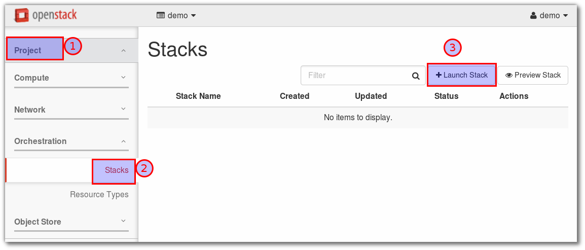

=======================================
Heat Orchestration Template (HOT) Guide
=======================================

Writing a hello world HOT template
==================================
basic template
--------------
get variable::

  mkdir templates
  cd templates
  openstack keypair create demo_heat_key > demo_heat_key.priv
  chmod 600 demo_heat_key.priv

  openstack keypair list
  +---------------+-------------------------------------------------+
  | Name          | Fingerprint                                     |
  +---------------+-------------------------------------------------+
  | demo_heat_key | 8e:0a:17:fb:4a:d5:b4:26:47:ca:f1:b4:c0:d2:fe:fb |
  +---------------+-------------------------------------------------+

  openstack image list
  +--------------------------------------+---------------+--------+
  | ID                                   | Name          | Status |
  +--------------------------------------+---------------+--------+
  | a508d524-59c8-46da-9056-a3ec60d18194 | centos7_image | active |
  | 60614167-dfec-4e5b-be5d-1b5217c53926 | cirros image  | active |
  +--------------------------------------+---------------+--------+

  openstack flavor list
  +----+-----------+-------+------+-----------+-------+-----------+
  | ID | Name      |   RAM | Disk | Ephemeral | VCPUs | Is Public |
  +----+-----------+-------+------+-----------+-------+-----------+
  | 1  | m1.tiny   |   512 |    1 |         0 |     1 | True      |
  | 2  | m1.small  |  2048 |   20 |         0 |     1 | True      |
  | 3  | m1.medium |  4096 |   40 |         0 |     2 | True      |
  | 4  | m1.large  |  8192 |   80 |         0 |     4 | True      |
  | 5  | m1.xlarge | 16384 |  160 |         0 |     8 | True      |
  +----+-----------+-------+------+-----------+-------+-----------+

vi templates1.yaml

content::

  heat_template_version: 2015-04-30
  description: Simple template to deploy a single compute instance
  resources:
    my_instance:
      type: OS::Nova::Server
      properties:
        key_name: demo_heat_key
        image: centos7_image
        flavor: m1.small

create stack
First Error::

  heat stack-create my_first_stack -f template1.yaml
  ERROR: Missing required credential: roles ['heat_stack_owner']

.. important:: Only user who in role 'heat_stack_owner' can create template

So change permission from demo to admin again by souce openrc_v3 (admin)::

  source  openrc_v3
  Please enter your OpenStack Password:

  openstack role list
  +----------------------------------+------------------+
  | ID                               | Name             |
  +----------------------------------+------------------+
  | 0c1f2cc1e4894828811e87a878f19e16 | admin            |
  | 37d1c4b9be934f16a317b51b12691e42 | heat_stack_user  |
  | 3d729cf45c794c3b9929d4616d011ce8 | heat_stack_owner |
  | 6b6046474d044dc2ab875697d2399774 | SwiftOperator    |
  | 93480ad903d4452697e5fe625da6202c | ResellerAdmin    |
  | 9fe2ff9ee4384b1894a90878d3e92bab | _member_         |
  | e718c008eb8343ada2f342c2ab986e00 | user             |
  +----------------------------------+------------------+

  add more role of user ``demo`` in project ``demo``
  openstack role add --project demo --user demo heat_stack_owner
  +-----------+----------------------------------+
  | Field     | Value                            |
  +-----------+----------------------------------+
  | domain_id | None                             |
  | id        | 3d729cf45c794c3b9929d4616d011ce8 |
  | name      | heat_stack_owner                 |
  +-----------+----------------------------------+

.. image:: _images/stack14.png

Continue::

  source demorc_v3
  Please enter your OpenStack Password:
  cd templates

  heat stack-create my_first_stack -f template1.yaml
  +--------------------------------------+----------------+--------------------+---------------------+--------------+
  | id                                   | stack_name     | stack_status       | creation_time       | updated_time |
  +--------------------------------------+----------------+--------------------+---------------------+--------------+
  | a4292ca8-3887-4ed4-80a9-c32cc2b3beab | my_first_stack | CREATE_IN_PROGRESS | 2016-07-27T13:12:24 | None         |
  +--------------------------------------+----------------+--------------------+---------------------+--------------+

Track Error
-----------

.. image:: _images/stack01.png

heat stack-show a4292ca8-3887-4ed4-80a9-c32cc2b3beab

.. image:: _images/stack02.png

What's error?
-------------
because there are more than on network. we have to identifier which network we want to
target to instance::

  neutron net-list
  +--------------------------------------+------------------+------------------------------------------------------+
  | id                                   | name             | subnets                                              |
  +--------------------------------------+------------------+------------------------------------------------------+
  | 59e6dd3e-68b4-49ed-863d-84651330ba65 | external_network | 93cd697a-c480-42bf-9d46-ed45dea185bb 192.168.56.0/24 |
  | bd8b7de6-c013-43a6-b32a-08747d467e8a | private          | 81c13ec9-b2c2-4a7b-b98e-9fb5502824c0 172.16.1.0/24   |
  +--------------------------------------+------------------+------------------------------------------------------+

In template will update to below. in nework value can use Network name or UUID::

  heat_template_version: 2015-04-30
  description: Simple template to deploy a single compute instance
  resources:
    my_instance:
      type: OS::Nova::Server
      properties:
        key_name: demo_heat_key
        image: centos7_image
        flavor: m1.small
        networks:
          - network: private

.. note::  cant not use tab. must use space. if use tab error will show
found character '\t' that cannot start any token

Try it again::

  cd ~
  source demorc_v3
  cd templates
  heat stack-create my_first_stack -f template1.yaml

verify ui

.. image:: _images/stack03.png

.. image:: _images/stack04.png

if heat success in create the template ``stack_status`` will show ``CREATE_COMPLETE``::

  heat stack-list
  +--------------------------------------+----------------+-----------------+---------------------+--------------+
  | id                                   | stack_name     | stack_status    | creation_time       | updated_time |
  +--------------------------------------+----------------+-----------------+---------------------+--------------+
  | e905b927-22c0-4cf2-a01f-37094d1f30b2 | my_first_stack | CREATE_COMPLETE | 2016-07-27T13:30:07 | None         |
  +--------------------------------------+----------------+-----------------+---------------------+--------------+

  heat stack-show e905b927-22c0-4cf2-a01f-37094d1f30b2
  +-----------------------+-------------------------------------------------------------------------------------------------------------------                                                  ---------------+
  | Property              | Value                                                                                                                                                                              |
  +-----------------------+-------------------------------------------------------------------------------------------------------------------                                                  ---------------+
  | capabilities          | []                                                                                                                                                                                 |
  | creation_time         | 2016-07-27T13:30:07                                                                                                                                                                |
  | description           | Simple template to deploy a single compute instance                                                                                                                                |
  | disable_rollback      | True                                                                                                                                                                               |
  | id                    | e905b927-22c0-4cf2-a01f-37094d1f30b2                                                                                                                                               |
  | links                 | http://192.168.56.200:8004/v1/f47553804d5d48529eea395c29da941d/stacks/my_first_stack/e905b927-22c0-4cf2-a01f-37094                                                  d1f30b2 (self) |
  | notification_topics   | []                                                                                                                                                                                 |
  | outputs               | []                                                                                                                                                                                 |
  | parameters            | {                                                                                                                                                                                  |
  |                       |   "OS::project_id": "f47553804d5d48529eea395c29da941d",                                                                                                                            |
  |                       |   "OS::stack_id": "e905b927-22c0-4cf2-a01f-37094d1f30b2",                                                                                                                          |
  |                       |   "OS::stack_name": "my_first_stack"                                                                                                                                               |
  |                       | }                                                                                                                                                                                  |
  | parent                | None                                                                                                                                                                               |
  | stack_name            | my_first_stack                                                                                                                                                                     |
  | stack_owner           | None                                                                                                                                                                               |
  | stack_status          | CREATE_COMPLETE                                                                                                                                                                    |
  | stack_status_reason   | Stack CREATE completed successfully                                                                                                                                                |
  | stack_user_project_id | 8498d2b8ccc04736a719641e41e85168                                                                                                                                                   |
  | tags                  | null                                                                                                                                                                               |
  | template_description  | Simple template to deploy a single compute instance                                                                                                                                |
  | timeout_mins          | None                                                                                                                                                                               |
  | updated_time          | None                                                                                                                                                                               |
  +-----------------------+-------------------------------------------------------------------------------------------------------------------                                                  ---------------+

Horizon ui also report the list of resource that heat use in creation

Delete stack
------------
::

  heat stack-list
  +--------------------------------------+----------------+-----------------+---------------------+--------------+
  | id                                   | stack_name     | stack_status    | creation_time       | updated_time |
  +--------------------------------------+----------------+-----------------+---------------------+--------------+
  | e905b927-22c0-4cf2-a01f-37094d1f30b2 | my_first_stack | CREATE_COMPLETE | 2016-07-27T13:30:07 | None         |
  +--------------------------------------+----------------+-----------------+---------------------+--------------+
  heat stack-list
  +--------------------------------------+----------------+-----------------+---------------------+--------------+
  | id                                   | stack_name     | stack_status    | creation_time       | updated_time |
  +--------------------------------------+----------------+-----------------+---------------------+--------------+
  | e905b927-22c0-4cf2-a01f-37094d1f30b2 | my_first_stack | CREATE_COMPLETE | 2016-07-27T13:30:07 | None         |
  +--------------------------------------+----------------+-----------------+---------------------+--------------+

  heat stack-delete  e905b927-22c0-4cf2-a01f-37094d1f30b2
  Are you sure you want to delete this stack(s) [y/N]? y
  +--------------------------------------+----------------+-----------------+---------------------+--------------+
  | id                                   | stack_name     | stack_status    | creation_time       | updated_time |
  +--------------------------------------+----------------+-----------------+---------------------+--------------+
  | e905b927-22c0-4cf2-a01f-37094d1f30b2 | my_first_stack | CREATE_COMPLETE | 2016-07-27T13:30:07 | None         |
  +--------------------------------------+----------------+-----------------+---------------------+--------------+

  heat stack-list
  +--------------------------------------+----------------+-----------------+---------------------+--------------+
  | id                                   | stack_name     | stack_status    | creation_time       | updated_time |
  +--------------------------------------+----------------+-----------------+---------------------+--------------+
  | e905b927-22c0-4cf2-a01f-37094d1f30b2 | my_first_stack | DELETE_COMPLETE | 2016-07-27T13:30:07 | None         |
  +--------------------------------------+----------------+-----------------+---------------------+--------------+

  heat stack-delete  e905b927-22c0-4cf2-a01f-37094d1f30b2
  Are you sure you want to delete this stack(s) [y/N]? y
  +--------------------------------------+----------------+-----------------+---------------------+--------------+
  | id                                   | stack_name     | stack_status    | creation_time       | updated_time |
  +--------------------------------------+----------------+-----------------+---------------------+--------------+
  | e905b927-22c0-4cf2-a01f-37094d1f30b2 | my_first_stack | CREATE_COMPLETE | 2016-07-27T13:30:07 | None         |
  +--------------------------------------+----------------+-----------------+---------------------+--------------+

  heat stack-list
  +--------------------------------------+----------------+-----------------+---------------------+--------------+
  | id                                   | stack_name     | stack_status    | creation_time       | updated_time |
  +--------------------------------------+----------------+-----------------+---------------------+--------------+
  | e905b927-22c0-4cf2-a01f-37094d1f30b2 | my_first_stack | DELETE_COMPLETE | 2016-07-27T13:30:07 | None         |
  +--------------------------------------+----------------+-----------------+---------------------+--------------+

User input Parameter
--------------------
Input parameters defined in the ``parameters`` section of a template allow users to customize a template
during deployment. Provide ``default`` value. Create file template2.ymal on host machine because we will
upload directly to horizon (Base not in Instance)::

  ## create on Host
  cd ~
  mkdir templates
  vim templates2.yaml

content::

  heat_template_version: 2015-04-30

  description: Simple template to deploy a single compute instance

  parameters:
    key_name:
      type: string
      label: Key Name
      description: Name of key-pair to be used for compute instance
      default: demo_heat_key
    image_id:
      type: string
      label: Image ID
      description: Image to be used for compute instance
      default: centos7_image
    flavor:
      type: string
      label: Instance Type
      description: Type of instance (flavor) to be used
      default: m1.small
    network:
      type: string
      label: Network Name or UUID
      description: Tenent network
      default: private

  resources:
    my_instance:
      type: OS::Nova::Server
      properties:
        key_name: { get_param: key_name }
        image: { get_param: image_id }
        flavor: { get_param: flavor }
        networks:
          - network: {get_param: network}

upload stack to horizon
-----------------------
upload by goto

select file

form will display according from templates. Horizon will auto generate form smartly.

.. image:: _images/stack08.png

create process

.. image:: _images/stack09.png

create success

Check instance

.. image:: _images/stack11.png

SSH to instance with key from network namespace
-----------------------------------------------
steps
  #. we create router connect external network and private network
  #. use command ``ip netns exec`` connect to router namespace
  #. use command ``ssh -i <keyname>  centos@<ip of instance>

::

  source demorc_v3
  Please enter your OpenStack Password:

  ## create router
  neutron router-create router1
  Created a new router:
  +-------------------------+--------------------------------------+
  | Field                   | Value                                |
  +-------------------------+--------------------------------------+
  | admin_state_up          | True                                 |
  | availability_zone_hints |                                      |
  | availability_zones      |                                      |
  | description             |                                      |
  | external_gateway_info   |                                      |
  | id                      | ca88d6b9-ba9a-45cb-a92b-f87cd82da806 |
  | name                    | router1                              |
  | routes                  |                                      |
  | status                  | ACTIVE                               |
  | tenant_id               | f47553804d5d48529eea395c29da941d     |
  +-------------------------+--------------------------------------+

  neutron net-list
  +--------------------------------------+------------------+------------------------------------------------------+
  | id                                   | name             | subnets                                              |
  +--------------------------------------+------------------+------------------------------------------------------+
  | 59e6dd3e-68b4-49ed-863d-84651330ba65 | external_network | 93cd697a-c480-42bf-9d46-ed45dea185bb 192.168.56.0/24 |
  | bd8b7de6-c013-43a6-b32a-08747d467e8a | private          | 81c13ec9-b2c2-4a7b-b98e-9fb5502824c0 172.16.1.0/24   |
  +--------------------------------------+------------------+------------------------------------------------------+

  ## set router gateway with external_network
  neutron router-gateway-set router1 external_network
  Set gateway for router router1

  ## set interface with private subnet
  ## find subnet first

  neutron subnet-list
  +--------------------------------------+----------------+-----------------+------------------------------------------------------+
  | id                                   | name           | cidr            | allocation_pools                                     |
  +--------------------------------------+----------------+-----------------+------------------------------------------------------+
  | 81c13ec9-b2c2-4a7b-b98e-9fb5502824c0 | private_subnet | 172.16.1.0/24   | {"start": "172.16.1.2", "end": "172.16.1.254"}       |
  | 93cd697a-c480-42bf-9d46-ed45dea185bb | public_subnet  | 192.168.56.0/24 | {"start": "192.168.56.210", "end": "192.168.56.220"} |
  +--------------------------------------+----------------+-----------------+------------------------------------------------------+

  ## add interface to router
  neutron router-interface-add router1 private_subnet
  Added interface b0dd8d88-cbfa-4bbc-8271-7893f6a6ace7 to router router1.

Verify router in UI
-------------------

.. image:: _images/stack12.png

list neutron router::

  neutron router-list
  +--------------------------------------+---------+--------------------------------------------------------------------------------------------------------+
  | id                                   | name    | external_gateway_info                                                                                  |
  +--------------------------------------+---------+--------------------------------------------------------------------------------------------------------+
  | ca88d6b9-ba9a-45cb-a92b-f87cd82da806 | router1 | {"network_id": "59e6dd3e-68b4-49ed-863d-84651330ba65", "enable_snat": true, "external_fixed_ips":      |
  |                                      |         | [{"subnet_id": "93cd697a-c480-42bf-9d46-ed45dea185bb", "ip_address": "192.168.56.211"}]}               |
  +--------------------------------------+---------+--------------------------------------------------------------------------------------------------------+

Network Namespace
-----------------
Linux namespace have 2 types
  * Router namespace
  * Dhcp server namespace

::

  ## list namespace
  ip netns
  qrouter-ca88d6b9-ba9a-45cb-a92b-f87cd82da806
  qdhcp-bd8b7de6-c013-43a6-b32a-08747d467e8a

  ## check ip in router namespace
  ip netns exec qrouter-ca88d6b9-ba9a-45cb-a92b-f87cd82da806 ip a
  1: lo: <LOOPBACK,UP,LOWER_UP> mtu 65536 qdisc noqueue state UNKNOWN
      link/loopback 00:00:00:00:00:00 brd 00:00:00:00:00:00
      inet 127.0.0.1/8 scope host lo
         valid_lft forever preferred_lft forever
      inet6 ::1/128 scope host
         valid_lft forever preferred_lft forever
  22: qg-ca01d1ca-1d: <BROADCAST,MULTICAST,UP,LOWER_UP> mtu 1500 qdisc noqueue state UNKNOWN
      link/ether fa:16:3e:c3:85:52 brd ff:ff:ff:ff:ff:ff
      inet 192.168.56.211/24 brd 192.168.56.255 scope global qg-ca01d1ca-1d
         valid_lft forever preferred_lft forever
      inet6 fe80::f816:3eff:fec3:8552/64 scope link
         valid_lft forever preferred_lft forever
  23: qr-b0dd8d88-cb: <BROADCAST,MULTICAST,UP,LOWER_UP> mtu 1500 qdisc noqueue state UNKNOWN
      link/ether fa:16:3e:71:ff:15 brd ff:ff:ff:ff:ff:ff
      inet 172.16.1.1/24 brd 172.16.1.255 scope global qr-b0dd8d88-cb
         valid_lft forever preferred_lft forever
      inet6 fe80::f816:3eff:fe71:ff15/64 scope link
         valid_lft forever preferred_lft forever

Network diagram
----------------
  * qg-ca01d1ca-1d  is "qg-vvv" port connect to br-ex
  * qr-b0dd8d88-cb  is "qr-yyy" port connect to dnsmasq (dhcp server) of private network

.. image:: _images/under-the-hood-scenario-1-ovs-network.png

Check dnsmasq process in dhcp router namespace::

  ip netns exec qdhcp-bd8b7de6-c013-43a6-b32a-08747d467e8a ps -ef | grep dnsmasq
  nobody    8292     1  0 20:33 ?        00:00:00 dnsmasq --no-hosts --no-resolv --strict-order
  --except-interface=lo --pid-file=/var/lib/neutron/dhcp/bd8b7de6-c013-43a6-b32a-08747d467e8a/pid
  --dhcp-hostsfile=/var/lib/neutron/dhcp/bd8b7de6-c013-43a6-b32a-08747d467e8a/host
  --addn-hosts=/var/lib/neutron/dhcp/bd8b7de6-c013-43a6-b32a-08747d467e8a/addn_hosts
  --dhcp-optsfile=/var/lib/neutron/dhcp/bd8b7de6-c013-43a6-b32a-08747d467e8a/opts
  --dhcp-leasefile=/var/lib/neutron/dhcp/bd8b7de6-c013-43a6-b32a-08747d467e8a/leases
  --dhcp-match=set:ipxe,175 --bind-interfaces --interface=tap5b70dc00-0a
  --dhcp-range=set:tag0,172.16.1.0,static,86400s --dhcp-option-force=option:mtu,1500
  --dhcp-lease-max=256 --conf-file= --domain=openstacklocal

How to ssh with key to Instance from namespace
----------------------------------------------
because every namespace share file system. so we can ssh from namespace. our instance
has ip ``172.16.1.4``

.. image:: _images/stack13.png

Edit secgroup (set of security) allow ping, 22/tcp before access to instance::

  nova secgroup-add-rule GROUP \
          PROTOCOL \
          FROM \
          TO \
          CIDR

  ## secgroup list
  nova secgroup-list
  +--------------------------------------+---------+------------------------+
  | Id                                   | Name    | Description            |
  +--------------------------------------+---------+------------------------+
  | 6c93be93-3cda-430c-90f3-bb9914d8bf94 | default | Default security group |
  +--------------------------------------+---------+------------------------+

  ## create
  nova secgroup-create Allow_Access_Group  "Allow Ping/icmp and SSH 22/tcp"
  +--------------------------------------+--------------------+--------------------------------+
  | Id                                   | Name               | Description                    |
  +--------------------------------------+--------------------+--------------------------------+
  | 6f3b9692-c43b-4d2c-b3a3-fdf8df17f9b0 | Allow_Access_Group | Allow Ping/icmp and SSH 22/tcp |
  +--------------------------------------+--------------------+--------------------------------+

  ## List rules
  nova secgroup-list-rules Allow_Access_Group
  +-------------+-----------+---------+----------+--------------+
  | IP Protocol | From Port | To Port | IP Range | Source Group |
  +-------------+-----------+---------+----------+--------------+
  +-------------+-----------+---------+----------+--------------+

  ## Allow 22
  nova secgroup-add-rule Allow_Access_Group tcp 22 22 0.0.0.0/0
  +-------------+-----------+---------+-----------+--------------+
  | IP Protocol | From Port | To Port | IP Range  | Source Group |
  +-------------+-----------+---------+-----------+--------------+
  | tcp         | 22        | 22      | 0.0.0.0/0 |              |
  +-------------+-----------+---------+-----------+--------------+

  ## full command
  ## nova secgroup-add-group-rule --ip_proto tcp --from_port 22 \
      --to_port 22 SECURITY_GROUP_NAME SOURCE_GROUP_NAME

  ## Allow Ping
  nova secgroup-add-rule Allow_Access_Group icmp -1 -1 0.0.0.0/0
  +-------------+-----------+---------+-----------+--------------+
  | IP Protocol | From Port | To Port | IP Range  | Source Group |
  +-------------+-----------+---------+-----------+--------------+
  | icmp        | -1        | -1      | 0.0.0.0/0 |              |
  +-------------+-----------+---------+-----------+--------------+

  ## full command
  ## nova secgroup-add-group-rule --ip_proto icmp --from_port -1 \
     --to_port -1 SECURITY_GROUP_NAME SOURCE_GROUP_NAME
  ## A port range of -1 to -1 is taken to mean that all valid ports are included.

Test Lab
--------
::

  # nova list
  +--------------------------------------+---------------------------------+--------+------------+-------------+--------------------+
  | ID                                   | Name                            | Status | Task State | Power State | Networks           |
  +--------------------------------------+---------------------------------+--------+------------+-------------+--------------------+
  | 9907bc14-a318-406e-a22b-4b57fe085acb | stack2-my_instance-6cu75j544tab | ACTIVE | -          | Running     | private=172.16.1.4 |
  +--------------------------------------+---------------------------------+--------+------------+-------------+--------------------+

  # openstack server list
  +--------------------------------------+---------------------------------+--------+--------------------+
  | ID                                   | Name                            | Status | Networks           |
  +--------------------------------------+---------------------------------+--------+--------------------+
  | 9907bc14-a318-406e-a22b-4b57fe085acb | stack2-my_instance-6cu75j544tab | ACTIVE | private=172.16.1.4 |
  +--------------------------------------+---------------------------------+--------+--------------------+

  # add secgroup to instance
  nova add-secgroup  9907bc14-a318-406e-a22b-4b57fe085acb Allow_Access_Group
  nova remove-secgroup 9907bc14-a318-406e-a22b-4b57fe085acb default

  ip netns exec qrouter-ca88d6b9-ba9a-45cb-a92b-f87cd82da806 ping -c 4 172.16.1.4
  ip netns exec qrouter-ca88d6b9-ba9a-45cb-a92b-f87cd82da806 ssh -i heat_key.priv centos@172.16.1.4

Neutron Package Flow
--------------------
All instance connect to Linux bridge::

  brctl show
  bridge name     bridge id               STP enabled     interfaces
  qbr80112dc0-fb          8000.7a11f98a10e7       no      qvb80112dc0-fb
                                                          tap80112dc0-fb

openvswitch bridge::

  ovs-vsctl show
  6c603c92-0806-4f8e-934f-e9ac7c770928
      Bridge br-int
          fail_mode: secure
          Port br-int
              Interface br-int
                  type: internal
          Port "tap5b70dc00-0a"
              tag: 1
              Interface "tap5b70dc00-0a"
                  type: internal
          Port int-br-ex
              Interface int-br-ex
                  type: patch
                  options: {peer=phy-br-ex}
          Port "qvo80112dc0-fb"
              tag: 1
              Interface "qvo80112dc0-fb"
          Port patch-tun
              Interface patch-tun
                  type: patch
                  options: {peer=patch-int}
          Port "qr-b0dd8d88-cb"
              tag: 1
              Interface "qr-b0dd8d88-cb"
                  type: internal
          Port "int-br-eth2"
              Interface "int-br-eth2"
                  type: patch
                  options: {peer="phy-br-eth2"}
      Bridge br-tun
          fail_mode: secure
          Port patch-int
              Interface patch-int
                  type: patch
                  options: {peer=patch-tun}
          Port br-tun
              Interface br-tun
                  type: internal
      Bridge br-ex
          Port "eth1"
              Interface "eth1"
          Port br-ex
              Interface br-ex
                  type: internal
          Port "qg-ca01d1ca-1d"
              Interface "qg-ca01d1ca-1d"
                  type: internal
          Port phy-br-ex
              Interface phy-br-ex
                  type: patch
                  options: {peer=int-br-ex}
      Bridge "br-eth2"
          Port "phy-br-eth2"
              Interface "phy-br-eth2"
                  type: patch
                  options: {peer="int-br-eth2"}
          Port "eth2"
              Interface "eth2"
                  error: "could not open network device eth2 (No such device)"
          Port "br-eth2"
              Interface "br-eth2"
                  type: internal
      ovs_version: "2.5.0"

virtual device
--------------

  * qvb80112dc0-fb is "qvbxxxx"  connect to "qvo80112dc0-fb"::

    Port "qvo80112dc0-fb"
              tag: 1
              Interface "qvo80112dc0-fb"

.. image:: _images/under-the-hood-scenario-1-ovs-compute.png

iptables in namespace
---------------------
::

  ip netns exec qrouter-ca88d6b9-ba9a-45cb-a92b-f87cd82da806 iptables-save

tcpdump
-------
::

  tcpdump -n -i br-int
  # capture traffic
  tcpdump -n -i br-int  -w tcpdump.pcap
  # view traffic
  tcpdump -r tcpdump.pcap
  #tcpdump -n -i any
